# 🎬 MovieReviews

**MovieReviews** es una aplicación web desarrollada con **Django 5** que permite gestionar usuarios, publicar reseñas de películas y mostrar noticias relacionadas con el cine.  
El proyecto incluye autenticación de usuarios, un sistema de reseñas dinámico, manejo de archivos multimedia y un panel de administración completo.

---

## 🚀 Características principales

- 🔐 Sistema de autenticación de usuarios (registro, login y logout).
- 📝 Publicación de reseñas de películas con soporte multimedia.
- 📰 Sección de noticias relacionadas al cine.
- 📂 Gestión de contenido estático y archivos multimedia.
- 🎛️ Panel de administración con **Django Admin** y editor enriquecido con **CKEditor**.
- 💾 Base de datos soportada en **SQLite** (desarrollo) y **MySQL** (producción).

---

## 📂 Estructura del proyecto
moviereviews/
│── accounts/ # App de autenticación de usuarios
│── media/ # Archivos subidos por los usuarios
│── movie/ # App para reseñas y gestión de películas
│── moviereviews/ # Configuración principal del proyecto Django
│── news/ # App de noticias de cine
│── static/ # Archivos estáticos (CSS, JS, imágenes)
│── manage.py # Script principal de Django
│── db.sqlite3 # Base de datos por defecto (SQLite)
│── requirements.txt # Dependencias del proyecto
│── README.md # Documentación
---

## Demo en vivo

Puedes ver la aplicación funcionando aquí:  
https://davidvivascamargo.pythonanywhere.com/

---

## ⚙️ Requisitos

Este proyecto usa **Python 3.12+** y **Django 5.2.4**.  
Dependencias principales:

- Django==5.2.4
- django-ckeditor==6.7.3
- mysqlclient==2.2.7
- PyMySQL==1.1.1
- Pillow==11.3.0

Puedes ver todas las dependencias en `requirements.txt`.

---

## 🛠️ Instalación y configuración

### 1️⃣ Clonar el repositorio
bash
https://github.com/davidvivascamargo/moviereviews.git
cd moviereviews

2️⃣ Crear y activar entorno virtual
python -m venv venv
source venv/bin/activate   # Linux / Mac
venv\Scripts\activate      # Windows

3️⃣ Instalar dependencias
pip install -r requirements.txt

4️⃣ Configurar variables de entorno

En el archivo moviereviews/settings.py, configura la base de datos y otras variables.
Por defecto se usa SQLite, pero puedes habilitar MySQL:

DATABASES = {
    'default': {
        'ENGINE': 'django.db.backends.mysql',
        'NAME': 'moviereviews_db',
        'USER': 'tu_usuario',
        'PASSWORD': 'tu_password',
        'HOST': 'localhost',
        'PORT': '3306',
    }
}

5️⃣ Aplicar migraciones
python manage.py migrate

6️⃣ Crear superusuario
python manage.py createsuperuser

7️⃣ Ejecutar servidor de desarrollo
python manage.py runserver

Ahora entra en 👉 http://localhost:8000

---

# Vista de la Aplicación MovieReviews

## 🏠 Home
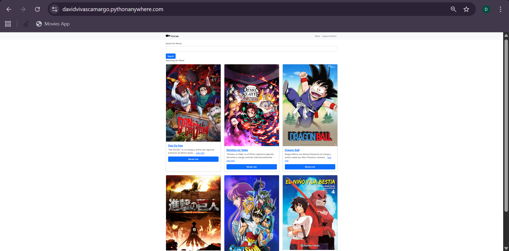  
*Pantalla de inicio de la aplicación.*  

## 🔐 Login y Registro
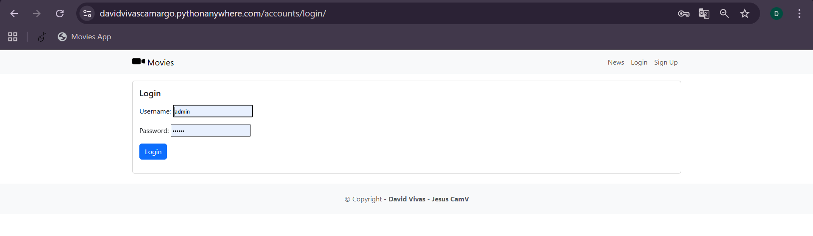  
*Formulario de inicio de sesión.*  

--

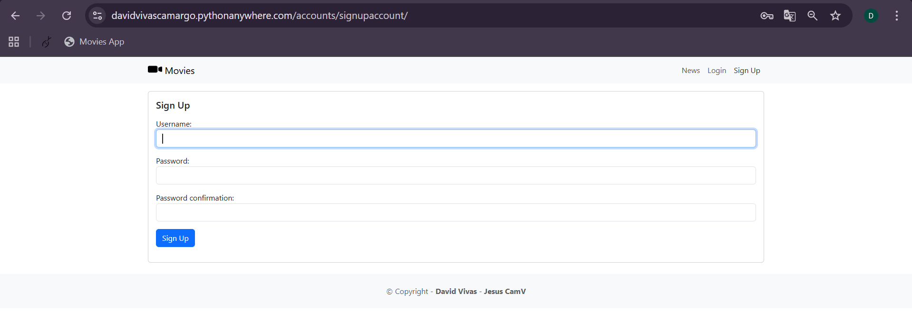  
*Formulario de registro de usuario.*  

## 🎬 Gestión de Películas
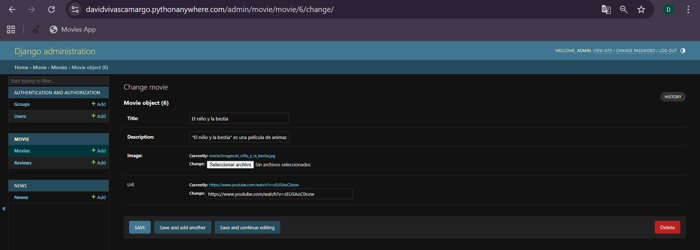  
*Formulario para crear una nueva película.*  

--

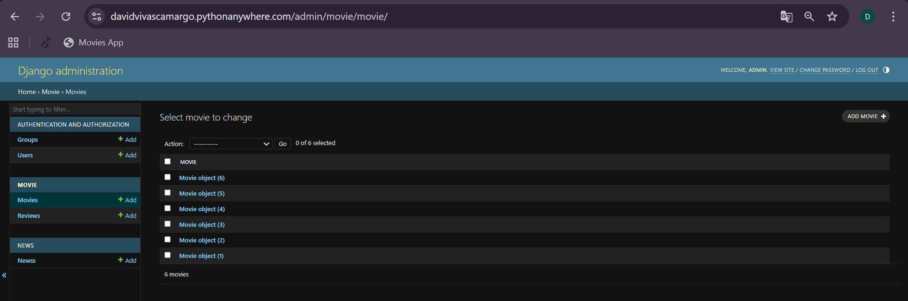  
*Panel para gestionar películas existentes.*  

## 📰 Noticias
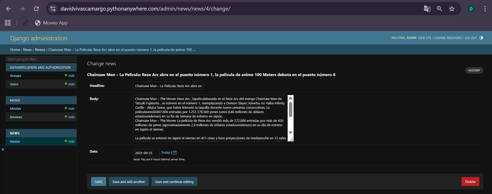  
*Formulario para crear noticias.*  

--

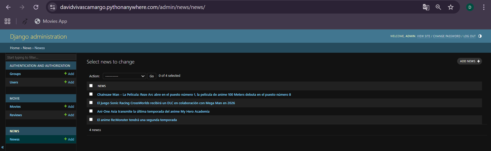  
*Panel de gestión de noticias existentes.*  

--

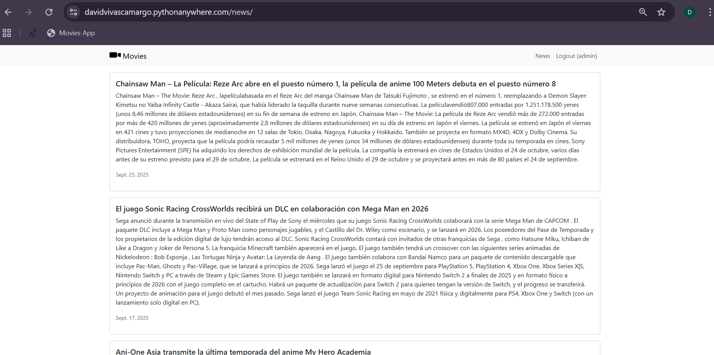  
*Vista de la sección de noticias en la página.*  

## 📝 Reseñas
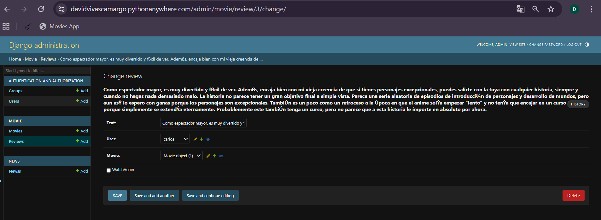  
*Formulario para crear reseñas de películas.*  

--

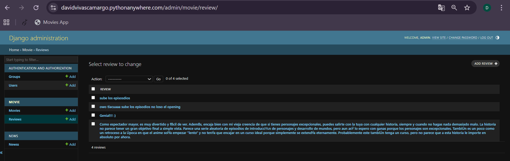  
*Panel de gestión de reseñas existentes.*  

--

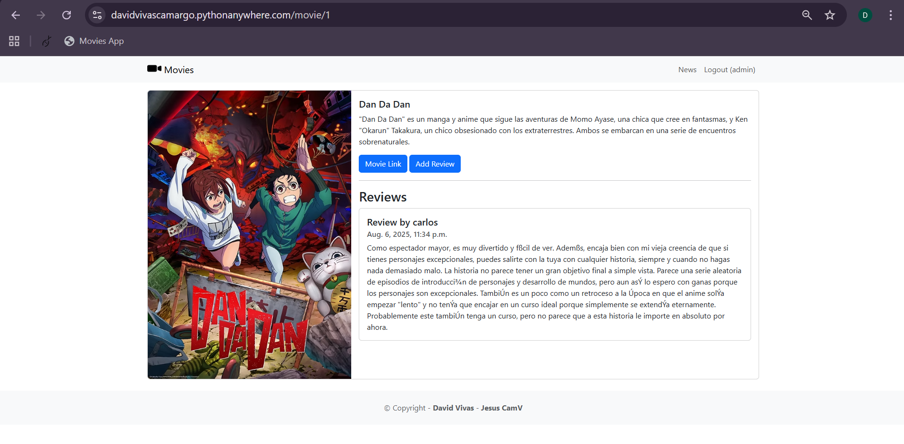  
*Vista de reseñas para usuarios.*  

--

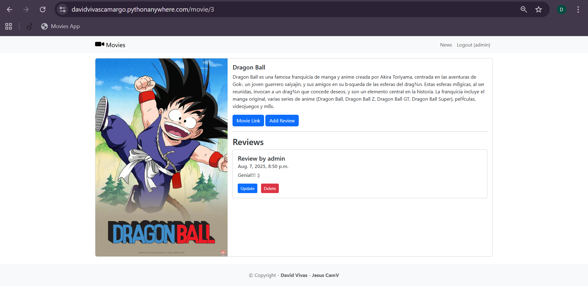  
*Vista de reseñas para administradores.*  

--

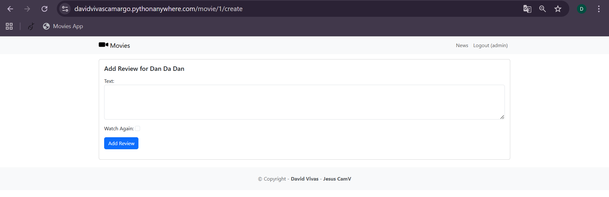  
*Formulario para añadir nuevas reseñas.*  

## ⚙️ Panel de Control
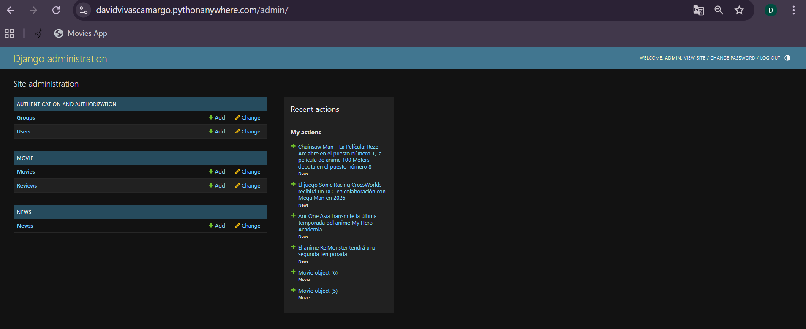  
*Vista general del panel de administración.*  

---

👨‍💻 **Autor**  
Desarrollado por Jesús David Vivas C.

📜 **Licencia**  
Este proyecto está bajo la licencia MIT. Eres libre de usarlo, modificarlo y distribuirlo.
